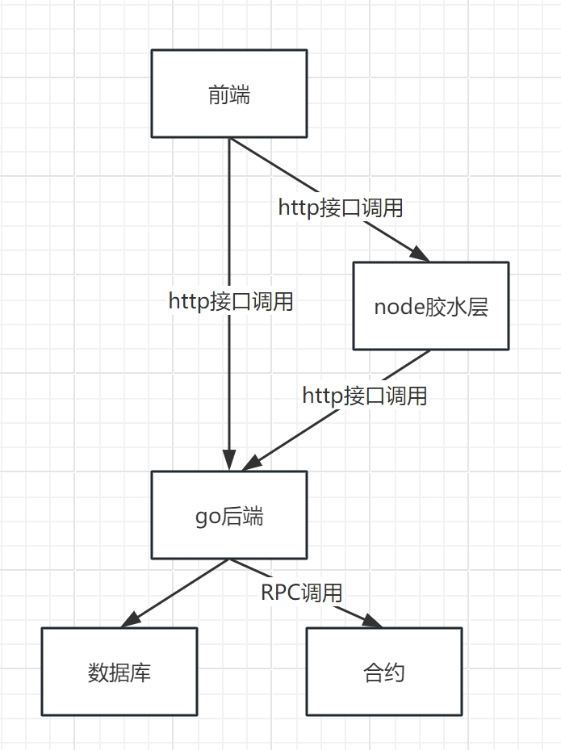

# 1.与eth交互
[以太坊开发文档](https://ethereum.org/zh/developers/docs/programming-languages/golang/)

## 1.1 前置环境

- 安装solc编译工具: https://docs.soliditylang.org/en/v0.8.2/installing-solidity.html#linux-packages
- 编译abigen命令: https://github.com/ethereum/go-ethereum
- 安装本地测试链: [ganache](https://trufflesuite.com/ganache)或者[hardhat](https://hardhat.org/hardhat-runner/docs/guides/deploying)

## 1.2 abi与bin生成

- abi bin 生成: solcjs --optimize --abi --bin ./eth/contracts/Bank.sol  -o build

## 1.3 生成合约go文件

- go文件生成: abigen --abi=./build/contracts_Bank_sol_Bank.abi   --bin=./build/contracts_Bank_sol_Bank.bin  --pkg=api --out=/api/Bank.go

# 2.与Ton交互
[Ton开发文档](https://docs.ton.org/mandarin/develop/dapps/apis/sdk)

# 3.架构图
